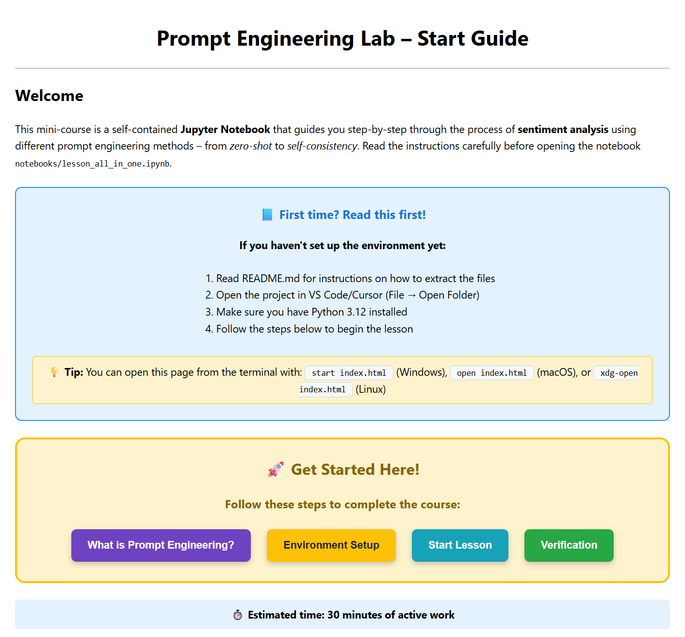
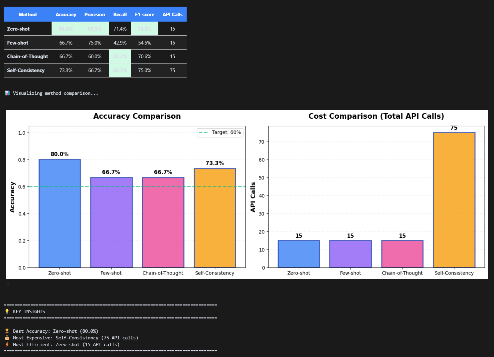

# Prompt Engineering Lab — Interactive Learning Journey

**A self-contained 30-minute lesson teaching practical prompt engineering techniques through hands-on sentiment analysis**

---

## 🎯 Getting the Project

Choose one of these methods to get started:

### Option 1: Clone from GitHub (Recommended)

```bash
git clone https://github.com/SelviAkdag/prompt-engineering-lab.git
cd prompt-engineering-lab
```

**→ After cloning, continue to Step 2 below**

### Option 2: Download ZIP

1. Download the ZIP file from the [releases page](https://github.com/SelviAkdag/prompt-engineering-lab/releases) 
2. Extract the ZIP file to your preferred location
3. Open terminal/command prompt in the extracted folder

---

## 🚀 Quick Start — Begin Here!

### Step 1: Extract the ZIP file

**⚠️ Skip this step if you used `git clone` above**

You've downloaded a ZIP file for this lesson (usually in your Downloads folder).

**Windows:**

1. Locate the ZIP file (usually in your Downloads folder)
2. Right-click on the ZIP file
3. Select "Extract All..." or "Extract to..."
4. Choose a destination folder (e.g., Desktop or Documents)
5. Click "Extract"

**macOS:**

1. Locate the ZIP file (usually in your Downloads folder)
2. Double-click the ZIP file
3. The folder will be automatically extracted to the same location
4. (Optional) Move the extracted folder to your preferred location

**Linux:**

1. Open terminal and navigate to where the ZIP file is located
2. Run: `unzip <filename>.zip` (replace `<filename>` with your ZIP file name)
3. Or use your file manager: Right-click → "Extract Here"

**✅ After extraction, you should see a folder containing files like:**

- `index.html`
- `README.md`
- `requirements.txt`
- Folders: `notebooks/`, `src/`, `data/`, etc.

### Step 2: Open `index.html`

**Option 1: Double-click**

- Navigate to the extracted project folder in your file explorer
- Find `index.html`
- Double-click on it → Opens in your default browser

**Option 2: Drag and drop**

- Open your web browser (Chrome, Firefox, Edge, Safari)
- Drag `index.html` from the folder into the browser window

**Option 3: Command line**

- Open terminal/command prompt in the project folder
- Run one of these commands:
  - Windows: `start index.html`
  - macOS: `open index.html`
  - Linux: `xdg-open index.html`

### Step 3: Follow the guide

The `index.html` page will guide you through:

1. Setting up your Python environment
2. Installing dependencies
3. Configuring the LLM backend (Ollama or OpenAI)
4. Opening and running the Jupyter notebook
5. Completing the lesson and verification


_Figure 1: The interactive start guide that walks you through the entire setup process step-by-step._

**⏱️ Estimated time: ~30 minutes active work**

---

## 📋 Overview

This is an interactive, self-contained lesson that teaches you how to improve AI model outputs using systematic prompt engineering. You'll learn four core techniques—**Zero-shot**, **Few-shot**, **Chain-of-Thought (CoT)**, and **Self-Consistency**—by applying them to a real sentiment analysis task.

**What makes this lesson special:**

- 🎯 **One comprehensive notebook** — Everything in `lesson_all_in_one.ipynb`
- 🤖 **Flexible AI backends** — Works with local Ollama or OpenAI API
- 📊 **Real metrics** — Compare accuracy, precision, recall, F1 across methods
- ✅ **Auto-graded** — Instant feedback via `verify.py`
- 🎓 **No instructor needed** — Completely self-contained with hints and guidance


_Figure 2: Example performance metrics comparing all four prompting techniques. You'll generate similar results showing how each method improves upon the previous one. OR NOT..._

---

## 🎯 Learning Objectives

By completing this lesson, you will:

1. **Understand** the core principles of prompt engineering and why it matters
2. **Apply** four different prompting techniques to the same classification task
3. **Compare** performance metrics across zero-shot, few-shot, CoT, and self-consistency
4. **Recognize** when to use each technique based on trade-offs (cost, speed, accuracy)
5. **Evaluate** real-world applications and best practices for production systems

---

## 📚 What You'll Learn

### 🔹 Zero-Shot Prompting

- Direct task instruction without examples
- When simplicity is enough
- Baseline performance metrics

### 🔹 Few-Shot Prompting

- Learning from examples in the prompt
- Selecting effective demonstrations
- Measuring improvement over zero-shot

### 🔹 Chain-of-Thought (CoT)

- Step-by-step reasoning guidance
- Breaking down complex decisions
- Trading latency for accuracy

### 🔹 Self-Consistency

- Multiple reasoning paths + voting
- Robustness through diversity
- Understanding cost vs. reliability

---

## 🗂️ Project Structure

```
├── index.html                      # 🌐 START HERE - Main lesson guide
├── README.md                       # 📖 This file
├── LICENSE                         # ⚖️ Apache 2.0 license
├── requirements.txt                # 📦 Pinned Python dependencies
├── .env.example                    # 🔐 Environment variables template
├── .env                            # 🔐 Your environment config (create from .env.example)
├── .gitignore                      # 🚫 Git ignore rules
├── Modelfile                       # 🔧 Custom Ollama model config (auto-created)
│
├── data/
│   └── sentiment_tiny.csv          # 📊 15-row sentiment dataset
│
├── notebooks/
│   └── lesson_all_in_one.ipynb     # 🎓 Complete interactive lesson (30 min)
│
├── src/
│   ├── config.py                   # ⚙️ Configuration management
│   ├── llm.py                      # 🤖 LLM backend interface (Ollama/OpenAI)
│   ├── prompting.py                # 💬 Core prompting functions
│   ├── metrics.py                  # 📊 Evaluation metrics (accuracy, F1, etc.)
│   ├── progress.py                 # 💾 Progress tracking system
│   ├── quiz_answers.py             # ✅ Quiz validation logic
│   ├── notebook_helpers.py         # 🎨 Interactive widgets & visualizations
│   └── verify.py                   # 🔍 Automated verification & grading
│
├── scripts/
│   ├── setup_venv.sh               # 🛠️ Virtual environment setup (Linux/Mac/WSL)
│   └── activate_and_setup.sh       # 🚀 Combined setup + activation
│
├── progress/
│   ├── lesson_progress.json        # 💾 Your progress data (auto-generated)
│   └── receipt.json                # 📜 Verification results (auto-generated)
│
└── run_lesson.sh                   # 🎬 Quick launch script for Jupyter
```

---

## 🖥️ System Requirements

### Required

- **Python 3.12+** (check with `python --version`)
- **Virtual environment** (`.venv`) — instructions provided
- **Git Bash** (Windows) or standard terminal (macOS/Linux)
- **One of:**
  - **Ollama** with `llama3.2-long` model (custom model with extended tokens, runs locally), OR
  - **OpenAI API key** (requires internet + API costs)

### Recommended

- **VS Code** or **Cursor** editor
- **8 GB RAM minimum** (for Ollama)
- **Internet connection** (for OpenAI API or initial package downloads)

### Supported Operating Systems

- ✅ Windows 11 (Git Bash / WSL)
- ✅ macOS (latest update)
- ✅ Ubuntu 22.04 / Linux

---

## 🛠️ Environment Setup

### Option 1: Automated Setup (Recommended)

**For Windows Git Bash / WSL / macOS / Linux:**

1. Open terminal in the project folder (VS Code: `Ctrl+Shift+` backtick)
2. Run the setup script:

```bash
source setup.sh
```

**What this does:**

- ✅ Creates virtual environment (`.venv`)
- ✅ Activates the environment
- ✅ Upgrades pip to latest version
- ✅ Installs all dependencies from `requirements.txt`
- ✅ Creates `.env` file with Ollama as default backend
- ✅ Creates `Modelfile` for extended token limit (300 tokens)

---

### Option 2: Manual Setup

If the script doesn't work, follow these steps:

**1. Create virtual environment:**

```bash
python -m venv .venv
```

**2. Activate environment:**

**Windows (Git Bash):**

```bash
source .venv/Scripts/activate
```

**macOS/Linux:**

```bash
source .venv/bin/activate
```

You should see `(.venv)` appear in your terminal prompt.

**3. Upgrade pip and install dependencies:**

```bash
python.exe -m pip install --upgrade pip
pip install -r requirements.txt
```

**4. Configure environment variables:**

```bash
cp .env.example .env
```

Edit `.env` to choose your backend:

- For **Ollama** (local): `MODEL_BACKEND=ollama` (default)
- For **OpenAI**: `MODEL_BACKEND=openai` and add your `OPENAI_API_KEY=sk-...`

---

## 🤖 LLM Backend Setup

You need **one** of the following:

### Option A: Ollama (Recommended - Free & Local)

**1. Install Ollama:**

- Visit https://ollama.ai
- Download and install for your OS

**2. Pull the model:**

```bash
ollama pull llama3.2:3b
```

**3. Create extended token model:**

```bash
ollama create llama3.2-long -f Modelfile
```

_Note: The Modelfile was auto-created during setup with increased token limit (300 instead of 128)._

**4. Verify it's running:**

```bash
ollama list
```

You should see both `llama3.2:3b` and `llama3.2-long` in the list.

**5. Start Ollama (if not auto-started):**

```bash
ollama serve
```

---

### Option B: OpenAI API

**1. Get API key:**

- Visit https://platform.openai.com/api-keys
- Create a new API key

**2. Configure `.env`:**

```bash
MODEL_BACKEND=openai
OPENAI_API_KEY=sk-your-key-here
OPENAI_MODEL=gpt-4o-mini
```

**Note:** Using OpenAI will incur API costs (~$0.01-0.05 for the full lesson).

---

## 🎓 Running the Lesson

### Method 1: Web Browser (Jupyter Notebook Classic)

**Best for:** Beginners or those who prefer browser-based Jupyter

1. **Activate environment** (if not already active):

```bash
source .venv/Scripts/activate  # Windows Git Bash
source .venv/bin/activate      # macOS/Linux
```

2. **Start Jupyter Notebook:**

```bash
jupyter notebook
```

3. **In the browser:**

   - Navigate to `notebooks/lesson_all_in_one.ipynb`
   - Click to open the notebook
   - Select kernel: **Kernel → Change kernel → Python (.venv)**

4. **Work through the lesson:**
   - Read each cell carefully
   - Run cells with `Shift+Enter`
   - Answer quiz questions
   - Experiment with prompts

---

### Method 2: VS Code/Cursor

**Best for:** Users comfortable with VS Code

1. **Open project in VS Code/Cursor:**

   - File → Open Folder → Select project folder

2. **Open notebook:**

   - Navigate to `notebooks/lesson_all_in_one.ipynb`
   - Click to open

3. **Select kernel:**

   - Click "Select Kernel" (top-right)
   - Choose "Python Environments..."
   - Select Python from `.venv`

4. **Work through the lesson** cell-by-cell

---

## ✅ Verification & Grading

After completing the notebook, verify your work:

### Option 1: Terminal

```bash
python src/verify.py
```

### Option 2: Inside Notebook (VS Code/Cursor)

Scroll to the final section **"Progress Tracker"** and run the last cell.

---

### What Gets Checked

The verification system validates:

- ✅ **All 4 methods executed** (zero-shot, few-shot, CoT, self-consistency)
- ✅ **Metrics recorded** for each method (accuracy, precision, recall, F1)
- ✅ **Performance threshold** met (at least one method ≥ 60% accuracy)
- ✅ **Quiz questions answered** (4 quiz questions total)
- ✅ **Reflection completed** (3 comparison questions)

---

### Understanding Results

**✅ PASS:**

```
✅ PASS: All checks passed!

📊 Summary:
   ✅ All 4 methods completed with metrics
   ✅ All 4 quiz questions answered
   ✅ All 3 reflections completed
   ✅ At least one method reached 60% accuracy

🎉 Congratulations! You have completed the Prompt Engineering Lab.
📄 Receipt saved to: progress/receipt.json
```

**❌ FAIL:**

```
FAIL: Missing metrics for section: few_shot

Run the few-shot section in the notebook and try again.
```

---

## 📊 Performance Receipt

After verification, a JSON receipt is generated at `progress/receipt.json`:

```json
{
  "timestamp": "2025-01-15T14:30:00Z",
  "status": "PASS",
  "score": 100,
  "max_score": 100,
  "checks": {
    "methods_completed": true,
    "metrics_recorded": true,
    "performance_threshold": true,
    "quiz_completed": true,
    "reflection_completed": true
  },
  "metrics": {
    "zero_shot": {
      "accuracy": 0.67,
      "precision": 0.71,
      "recall": 0.67,
      "f1": 0.66
    },
    "few_shot": {
      "accuracy": 0.73,
      "precision": 0.75,
      "recall": 0.73,
      "f1": 0.73
    },
    "cot": { "accuracy": 0.8, "precision": 0.82, "recall": 0.8, "f1": 0.8 },
    "self_consistency": {
      "accuracy": 0.87,
      "precision": 0.88,
      "recall": 0.87,
      "f1": 0.87
    }
  }
}
```

---

## 🎯 Educational Approach

This lesson uses proven pedagogical techniques:

### 🔹 Progressive Disclosure

- Concepts introduced step-by-step
- Build from simple (zero-shot) to complex (self-consistency)
- Each method builds on previous understanding

### 🔹 Hands-On Learning

- Execute real code with real LLMs
- Modify prompts and see immediate results
- Compare metrics across techniques

### 🔹 Immediate Feedback

- Interactive quizzes with instant validation
- Hint system for when you're stuck
- Automatic verification with detailed results

### 🔹 Scaffolded Support

- Detailed explanations for each concept
- Code comments and docstrings
- Troubleshooting tips throughout

### 🔹 Real-World Relevance

- Production-ready prompting patterns
- Cost/performance trade-off analysis
- Best practices from OpenAI/Anthropic guidelines

---

## 🧩 Interactive Features

### ✅ Quiz Questions

- Radio buttons for answer selection
- Instant feedback (green ✅ or red ❌)
- Explanations for correct/incorrect answers

### 💡 Hint System

- Click "Show Hint" when stuck
- Progressive hints (don't reveal full answer)
- Learn through guided discovery

### 📊 Metrics Dashboard

- Bar charts comparing method performance
- Accuracy, precision, recall, F1 scores
- Visual comparison of trade-offs

### 🎨 Interactive Widgets

- Text input for custom prompts
- Sliders for parameters (e.g., number of samples)
- Buttons to run experiments

---

## 🔧 Troubleshooting

### "ModuleNotFoundError" or "No module named X"

**Cause:** Wrong Python environment selected

**Fix:**

1. Make sure you activated `.venv`: `source .venv/Scripts/activate`
2. In Jupyter: Kernel → Change kernel → Select Python (.venv)
3. In VS Code: Click "Select Kernel" → Choose Python from `.venv`

---

### "Ollama connection refused"

**Cause:** Ollama not running

**Fix:**

```bash
ollama serve
```

Run this in a separate terminal window.

---

### "OpenAI API key not found"

**Cause:** `.env` file not configured

**Fix:**

1. Copy template: `cp .env.example .env`
2. Edit `.env` and add: `OPENAI_API_KEY=sk-your-key-here`
3. Restart Jupyter kernel (Kernel → Restart)

---

### Setup script permission denied

**Cause:** Script not executable

**Fix:**

```bash
chmod +x scripts/setup_venv.sh
./scripts/setup_venv.sh
```

---

### Verification fails but I completed everything

**Cause:** Progress file not saved properly

**Fix:**

1. Re-run all cells in the notebook from top to bottom
2. Make sure you click "Save Reflections" button
3. Run `python src/verify.py` again

---

## 📦 Dependencies

All dependencies are pinned in `requirements.txt`:

**Core Libraries:**

- `jupyter==1.1.1` — Notebook environment
- `ipywidgets==8.1.7` — Interactive widgets
- `pandas==2.3.3` — Data manipulation
- `matplotlib==3.8.0` — Visualizations

**LLM Backends:**

- `openai==1.44.0` — OpenAI API client
- `requests==2.32.5` — Ollama API client

**Utilities:**

- `python-dotenv==1.0.1` — Environment variable management
- Standard library modules (no external deps)

---

## 🔐 Environment Variables

Configure in `.env` (created from `.env.example`):

```bash
# Choose backend: "ollama" (local) or "openai" (API)
MODEL_BACKEND=ollama

# Ollama settings (if MODEL_BACKEND=ollama)
OLLAMA_MODEL=llama3.2-long
OLLAMA_BASE_URL=http://localhost:11434

# OpenAI settings (if MODEL_BACKEND=openai)
OPENAI_API_KEY=sk-your-key-here
OPENAI_MODEL=gpt-4o-mini
```

---

## 🎓 Assessment Criteria

You successfully complete the lesson when:

1. ✅ All 4 prompting methods executed with metrics
2. ✅ At least one method achieves ≥ 60% accuracy
3. ✅ All 4 quiz questions answered correctly
4. ✅ All 3 reflection questions completed with thoughtful responses
5. ✅ `verify.py` returns "PASS" status

**Time limit:** ~30 minutes active work (you can take longer if needed)

---

## 🎯 Learning Outcomes

After completing this lesson, you will be able to:

- ✅ **Explain** the differences between zero-shot, few-shot, CoT, and self-consistency
- ✅ **Choose** the right prompting technique based on task requirements
- ✅ **Implement** each technique in production code
- ✅ **Evaluate** performance using standard classification metrics
- ✅ **Analyze** cost/latency/accuracy trade-offs
- ✅ **Apply** best practices from OpenAI and Anthropic guidelines

---

## 🚀 What's Next?

After completing this lab, consider:

1. **Experiment with different models:**

   - Try larger Ollama models (e.g., `llama3:8b`)
   - Compare OpenAI models (`gpt-4o-mini` vs `gpt-4o`)

2. **Apply to your own data:**

   - Replace `sentiment_tiny.csv` with your own dataset
   - Modify prompts for different classification tasks

3. **Explore advanced techniques:**

   - Meta-prompting (prompts that generate prompts)
   - Retrieval-Augmented Generation (RAG)
   - Fine-tuning vs. prompt engineering trade-offs

4. **Production considerations:**
   - Implement caching for repeated queries
   - Add retry logic and error handling
   - Monitor costs and latency in production

---

## 📚 Additional Resources

### Prompt Engineering Guides

- [OpenAI Prompt Engineering Guide](https://platform.openai.com/docs/guides/prompt-engineering)
- [Anthropic Prompt Engineering Guide](https://docs.anthropic.com/claude/docs/prompt-engineering)
- [Prompt Engineering Guide (GitHub)](https://github.com/dair-ai/Prompt-Engineering-Guide)

### LLM Resources

- [Ollama Documentation](https://github.com/ollama/ollama)
- [OpenAI API Reference](https://platform.openai.com/docs/api-reference)

### Evaluation Metrics

- [Scikit-learn Metrics](https://scikit-learn.org/stable/modules/model_evaluation.html)
- [Precision, Recall, F1 Explained](https://en.wikipedia.org/wiki/Precision_and_recall)

---

## 🤝 Contact & Support

### Getting Help

1. **Check troubleshooting section** in this README
2. **Review `index.html`** for detailed setup instructions
3. **Run verification** to see specific issues: `python src/verify.py`

### Community & Questions

- **Discord**: @selvi_45396
- **Email**: selvi.akdag@hotmail.com
- **GitHub Issues**: [Report bugs or request features](https://github.com/YOUR-USERNAME/prompt-engineering-lab/issues)

### Reporting Issues

When reporting problems, please include:

- Your operating system (Windows/macOS/Linux)
- Python version: `python --version`
- Error messages (full traceback)
- Your `.env` configuration (without API keys!)

### Feedback & Contributions

We welcome feedback on the lesson content, difficulty level, and suggestions for improvement. This helps make the lesson better for future learners!

---

## License

This project is licensed under the [Apache License 2.0](LICENSE) - see the [LICENSE](LICENSE) file for details.

**Summary:**

- ✅ Free to use, modify, and distribute
- ✅ Commercial use allowed
- ✅ Must include original copyright notice
- ✅ Changes must be documented

Full license text: [Apache License 2.0](http://www.apache.org/licenses/LICENSE-2.0)

---

## 🎉 Ready to Start?

1. **Open `index.html` in your browser** (double-click the file)
2. **Follow the setup instructions** (takes ~5 minutes)
3. **Open the notebook** and start learning!
4. **Complete all sections** (~30 minutes)
5. **Run verification** to get your completion receipt

**Good luck, and enjoy learning prompt engineering! 🚀**
